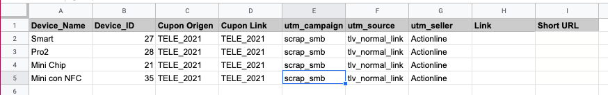

# CHOP Link Generator CLI 

This app generates Links from CHOP Checkout APP based on a CSV file. 

## Installation process 

Select some place in your machine and them clone the repository application. 

using HTTPs:  
```kotlin 
    git clone https://github.com/rbrossi-ml/LinkCHOPGenerator.git
```
or using SSH: 
```kotlin 
    git clone https://github.com/rbrossi-ml/LinkCHOPGenerator.git
```
run npm install inside the product folder.

```kotlin 
    npm install
```
to link the application to your operational system, inside de application golder run. 

```kotlin 
    npm link
```

Now you can start use the CHOP Link Generator CLI

## How to 

Select some folder were you can donwload your CSV File. 

The structure of this file have to follow the rules bellow in terms of hearder's name. 

| Field/Header name | Description | 
|-------------------|:------------| 
| Device_Name |        `Device name` 	|
| Device_ID	   |     `Device ID`
| Cupon Origen	|    `Cupon origim (Marketing tools)`|
| Cupon Link	|        `Cupon Link (Marketing tools)`|
| utm_campaign	 |   `Marketing campaign that this link will be associated`|
| utm_source      |    `Source of this link come from`	|
| utm_seller	  |      `Agency or EPS associated to it`|    
| Link	          |  `Empty field`  |  
| Short URL       |    `Empty field`|

Example of a Excel file, source of this tool inputs


Export it into a <code>CSV</code> file